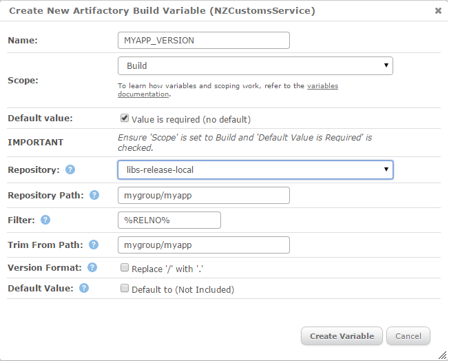
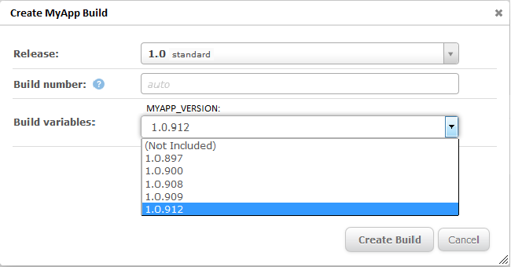
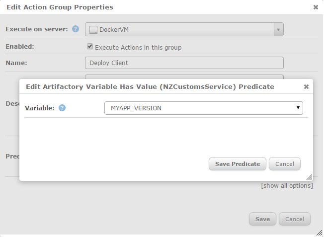
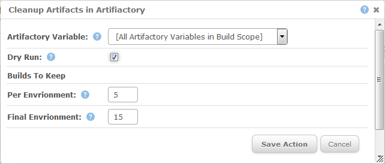

# bmx-artifactory-variable
A means of selecting specific application artifacts built and stored in Artifactory by another tool such as Jenkins.  Also has an action to delete unused artifacts from Artifactory. 

# Screenshots
## Create Variable (Configuration Screen)

## Variable in Action (Create New Build)

## Ensure A Build Has Been Selected (Action Group Predicate)
As (Not Selected) is a valid option, this predicate is useful for skipping action groups that rely on the value.

## Retrieve Artifact Over SSH

## Set Variable to Artifactory Path
Create/Update a variable with the path to the artifactory repository for the selected build, eg if the build 1.0.33 was selected the variable might get set to a value like this: MYAPP_PATH=libs-release-local/mygroup/myapp/0.1.33

## Cleanup Artifacts from Artifactory (Configuration Screen)

